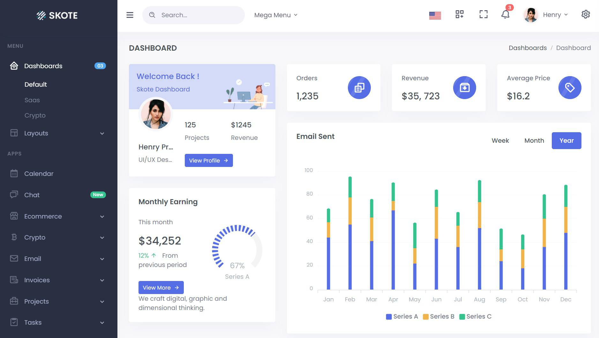

Skote is a fully featured premium admin console template in HTML & Laravel 8 with developer-friendly code and few reusable components. Outline files are also available with this template.

Skote is admin dashboard template is a sleek, minimalistic design admin template and neatly designed with Dark, Light Layout with RTL options. You can build any kind of web application like Saas-based interface, E-Commerce, Crypto, CRM, CMS, Project Management Application, Admin Panel, etc.
 
It will help your team move faster and save development costs and valuable time. If you are a developer and are looking for a fully responsive admin console with Bootstrap 4.5.0 in HTML or Laravel 7.x with reusable components then you've come to the right place to start your project with Skote.
 
Skote contains loads of newly designed widgets with responsiveness on all screens. Additionally, there are 6 different types of Layout that we've added. It is very easy to change any layout in your current running application by changing only a few lines of code as it is managed with scss variables. We wrote standard and developer-friendly code for increased performance. Customize or create your new color scheme by changing the value of the sass color variable or creating a new palette file.

**FEATURED**:
- Built with Bootstrap 4.5.0
- Light, Dark with RTL supported
- Multiple Layouts
- Fully Responsive Layout
- SASS Powered
- Sketch Files Available
- Clean & Well Commented Codes
- W3C Validated Code
- Box Icons
- E-Commerce Product, Orders, Customers, Cart, Checkout, Shops Pages
- Crypto Wallet, Exchange, Lending, ICO, Orders, KYC Application Pages
- Projects Grid, List, Overview Pages
- Tasks List, Kanban Board Pages
- Invoices List and Details pages
- Contacts and Profile page
- Data tables
- Google Fonts
- Not authorized Page
- FREE Lifetime Updates